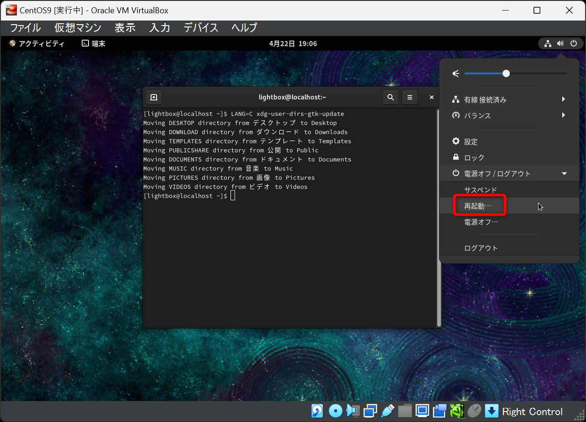

# VirtualBox に CentOS9をインストールする

## VirtualBoxの設定  


## CentOS9のインスール

`ESCキー`を押してスキップする  


`続行`をクリック  


`インスール先`をクリック  


`完了`をクリック  


`rootパスワード`をクリック  


パスワードを２回入力して、`完了`を２回クリック  


`ユーザーの作成`をクリック  


- `フルネーム`を入力
- `□このユーザーを管理者にする`にチェックを入れる
- パスワードを２回入力する
- `完了`を２回クリック 


`インストールの開始`をクリック


`システムの再起動`をクリック  


## 初期設定

ユーザー名をクリック  


パスワードを入力  


`必要ありません`をクリック  


`ターミナル`アプリをクリック  


下記コマンドを実行

```bash
sudo dnf upgrade -y
```

パスワードを入力する  
※入力されていないように見えるが、入力されている  


`完了しました！`が表示されたらOK  


下記コマンドを実行

```bash
LANG=C xdg-user-dirs-gtk-update
```


`Update Names`をクリック  


右上のエリアから再起動をする  




再度ログインする  


`次回から表示しない`にチェックを入れて`古い名前のままにする`をクリック


## SSHサーバーの起動

`ターミナル`アプリをクリック  


下記コマンドを実行

```bash
sudo systemctl start sshd.service
```


パスワードを入力する 


```bash
sudo systemctl status sshd.service
```


Active: active (running) になっていれば起動成功です。  


## Tera TermからSSH接続

- `ホスト` : localhost  


`続行`をクリック  


`ユーザー名`、`パスフレーズ(パスワード)`を入力  


SSH接続成功

