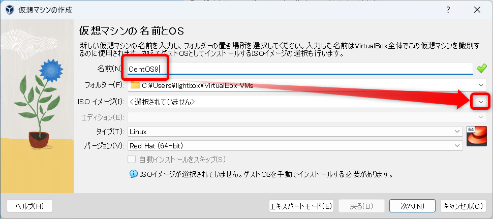
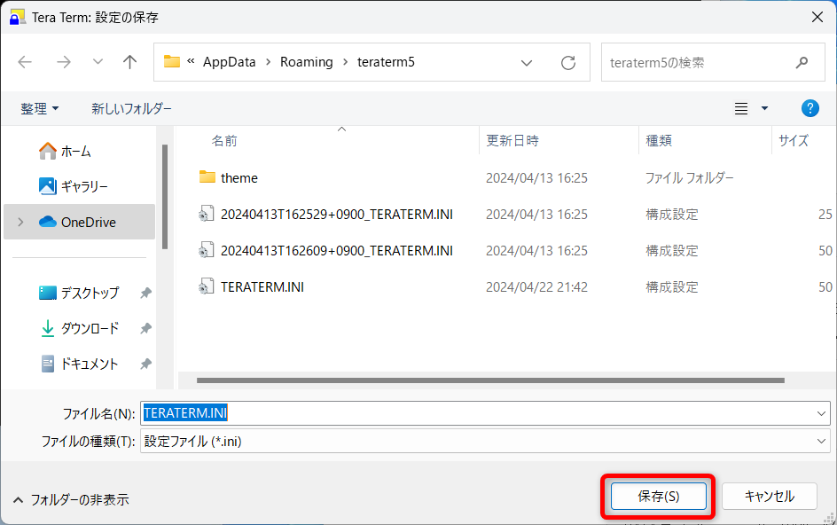

# VirtualBox に CentOS Stream 9をインストールする

## CentOS Stream 9のイメージをダウンロード

下記URLからCentOS Stream 9のイメージをダウンロード

https://www.centos.org/

※ダウンロードに時間がかかる場合は、[コチラ](https://drive.google.com/file/d/11A_h40pmYaYzP_ozPBaRSnOncTeYbXez/view?usp=drive_link)のGoogleドライブからダウンロード


`ダウンロード`フォルダに保存  
※サイズが大きいので時間がかかる


## VirtualBoxの設定

`新規`をクリック  


`名前`に`CentOS9`と入力して`ISOイメージ`の`↓`をクリック  


`その他`をクリック


`ダウンロード`フォルダからダウンロードした`CentOS-Stream-9～.iso`ファイルを選択して`開く`をクリック


`自動インストールをスキップ`にチェックを入れて`次へ`をクリック  


`EFIを有効化(一部のOSのみ)`にチェックを入れて`次へ`をクリック  


`次へ`をクリック  


`完了`をクリック  


### ポートフォワーディングの設定

`設定`をクリック  


`ネットワーク`をクリック  


`高度`をクリック  


`ポートフォワーディング`をクリック  


`+`マークをクリック  


下記設定の通りRuleを追加して`OK`をクリック  


**設定**

| ポート | 用途 |
| ----- | ---|
| 22   | SSH用    |
| 80   | HTTP用   |
| 3306 | MySQL用  |
| 8080 | Tomcat用 |

`OK`をクリック  


## CentOS Stream 9のインスール

`起動`をクリック  


このような画面が表示されたら`次回からこのメッセージを表示しない`にチェックして`キャプチャー`をクリック  
※右Ctrlキーで抜け出せる  


`Test this media & install CentOS Stream 9`のまま`Enter`  


右のウィンドウが表示されていたら邪魔なので、赤枠のアイコンをクリックして閉じる  


`ESCキー`を押してスキップする  


`続行`をクリック  


※画面がバグって見切れてしまう場合  
- VirtualBoxの`設定`→`ディスプレイ`→`グラフィックコントローラ`を`VBoxVGA`または`VMSVGA`に変更する
  - 途中で`表示`の`仮想スクリーン１`を`1024×768`に設定を変更する

※マウス操作ができない場合  
- VirtualBoxの`設定`→`システム`→`ポインティングデバイス`を`USBタブレット`または`PS/2マウス`に変更する

※上記手順で直らない場合は、一旦Windowsを再起動してみる

`インストール先`をクリック  


`完了`をクリック  


`rootパスワード`をクリック  


パスワードを２回入力して、`完了`を２回クリック  


`ユーザーの作成`をクリック  


- `フルネーム`を入力
- `□このユーザーを管理者にする`にチェックを入れる
- パスワードを２回入力する
- `完了`を２回クリック 


`インストールの開始`をクリック


インストール中  
※少し時間がかかる  


`システムの再起動`をクリック  


## CentOS Stream 9の初期設定

ユーザー名をクリック  


パスワードを入力  


`必要ありません`をクリック  


インストール完了


## Tera TermからSSH接続

- `ホスト` : localhost  
- `TCPポート` : 22


`続行`をクリック  


`ユーザー名`、`パスフレーズ(パスワード)`を入力  


SSH接続成功


### DeleteキーとMetaキーの設定

`設定`→`キーボード`をクリック  


- `Deleteキー`のチェックを外す
- `Metaキー`を`on`に変える
- `OK`をクリック


`設定`→`設定の保存`をクリック


`保存`をクリック  


`はい`をクリック  


## アップデート

下記コマンドを実行してCentOSをアップデートする

```bash
sudo dnf upgrade -y
```


パスワードを入力する  
※入力されていないように見えるが、入力されている  


インストール中  
※エラーが出る場合は、`ユーザーの作成`で`このユーザーを管理者にする`にチェックしなかった場合

対処方法  
```bash
su -
visudo /etc/sudoers

# 101行目付近rootの下に下記を追記
lightbox    ALL=(ALL)       ALL
```


`完了しました！`が表示されたらOK  


## 終了方法

VirtualBoxの`✕ボタン`をクリック  


`仮想マシンの状態を保存`をクリック  


## 起動方法

起動したい対象を選択して`起動`ボタンをクリック  


起動後は最小化しておく  

