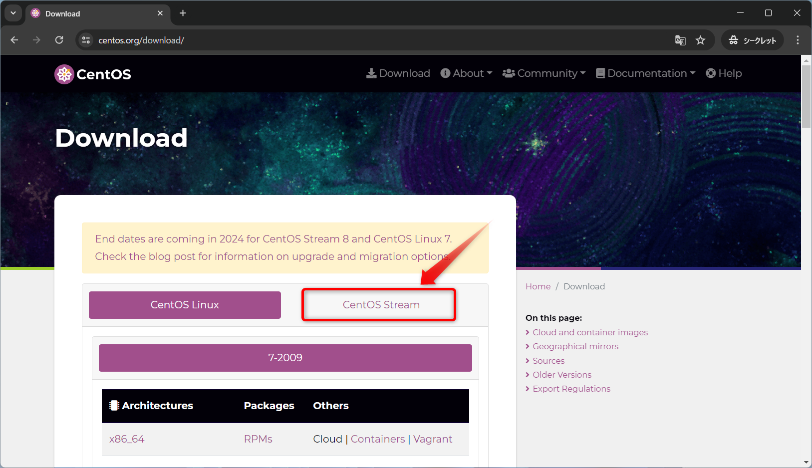
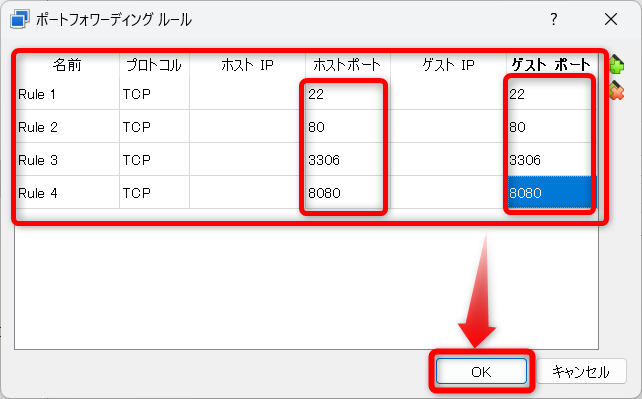
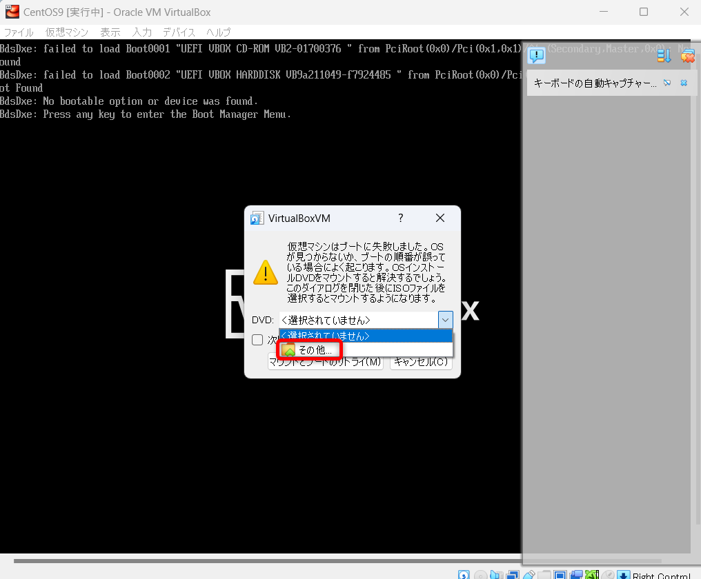

# VirtualBox に CentOS Stream 9をインストールする

## CentOS Stream 9のイメージをダウンロード

下記URLからCentOS Stream 9のイメージをダウンロード

https://www.centos.org/





`ダウンロード`フォルダに保存  
※サイズが大きいので時間がかかる


## VirtualBoxの設定

`新規`をクリック  


`名前`に`CentOS9`と入力して`次へ`をクリック  


`EFIを有効化(一部のOSのみ)`にチェックを入れて`次へ`をクリック  


`次へ`をクリック  


`完了`をクリック  


`設定`をクリック  


### ポートフォワーディングの設定

`ネットワーク`をクリック  


`高度`をクリック  


`ポートフォワーディング`をクリック  


`+`マークをクリック  


下記設定の通りRuleを追加して`OK`をクリック  


**設定**

| ポート | 用途 |
| ----- | ---|
| 22   | SSH用    |
| 80   | HTTP用   |
| 3306 | MySQL用  |
| 8080 | Tomcat用 |
| 20   | FTP用    |
| 21   | FTP用    |
| 445  | Samba用  |

`OK`をクリック  


## CentOS Stream 9のインスール

`起動`をクリック  


`↓`をクリック  


`その他`をクリック  


`ダウンロード`フォルダにダウンロードしたCentOS Stream 9の`.iso`ファイルを選択して`開く`をクリック


`マウントとブートのリトライ`をクリック  


このような画面が表示されたら`次回からこのメッセージを表示しない`にチェックして`キャプチャー`をクリック  
※右Ctrlキーで抜け出せる  


`Test this media & install CentOS Stream 9`のまま`Enter`  


右のウィンドウが表示されていたら邪魔なので、赤枠のアイコンをクリックして閉じる  


`ESCキー`を押してスキップする  


`続行`をクリック  


`インストール先`をクリック  


`完了`をクリック  


`rootパスワード`をクリック  


パスワードを２回入力して、`完了`を２回クリック  


`ユーザーの作成`をクリック  


- `フルネーム`を入力
- `□このユーザーを管理者にする`にチェックを入れる
- パスワードを２回入力する
- `完了`を２回クリック 


`インストールの開始`をクリック


`システムの再起動`をクリック  


## CentOS Stream 9の初期設定

ユーザー名をクリック  


パスワードを入力  


`必要ありません`をクリック  


`ターミナル`アプリをクリック  


下記コマンドを実行

```bash
sudo dnf upgrade -y
```

パスワードを入力する  
※入力されていないように見えるが、入力されている  


`完了しました！`が表示されたらOK  


下記コマンドを実行

```bash
LANG=C xdg-user-dirs-gtk-update
```


`Update Names`をクリック  


右上のエリアから再起動をする  


再度ログインする  


`次回から表示しない`にチェックを入れて`古い名前のままにする`をクリック


## SSHサーバーの起動

`ターミナル`アプリをクリック  


下記コマンドを実行

```bash
sudo systemctl start sshd.service
```


パスワードを入力する 


```bash
sudo systemctl status sshd.service
```


Active: active (running) になっていれば起動成功です。  


## Tera TermからSSH接続

- `ホスト` : localhost  


`続行`をクリック  


`ユーザー名`、`パスフレーズ(パスワード)`を入力  


SSH接続成功


### Deleteキーの設定

`設定`→`キーボード`をクリック  


`Deleteキー`のチェックを外して`OK`をクリック  


`設定`→`設定の保存`をクリック


`保存`をクリック  


`はい`をクリック  


